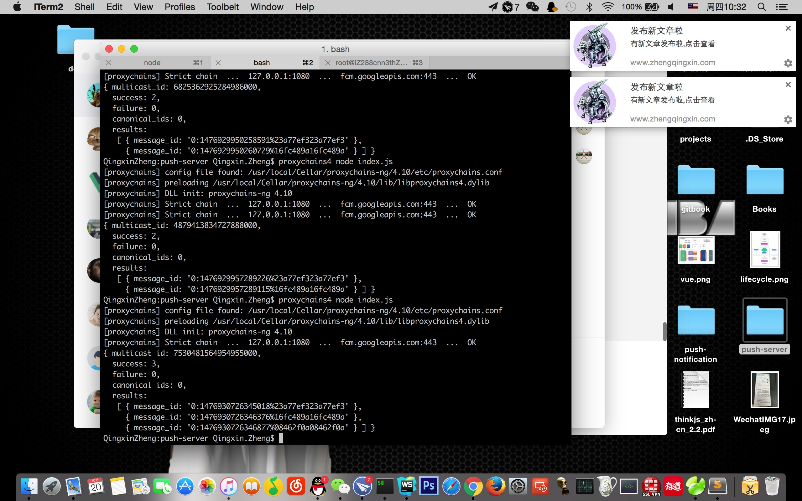
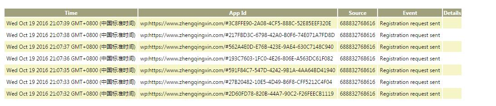
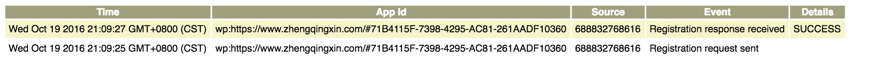

# 消息推送功能“全军覆没”

> 最近项目节奏放缓，我们的项目属于内部系统，使用者大部分为紧跟科技脚步的“潮人”，chrome 在我们系统中占据了半壁江山(谦虚的说)，所以打算在项目中试试 Service Worker ，打算先从推送功能入手，然而我却被啪啪打脸，于是我怒写了这篇文章。

## 兴高采烈的开始
### 切 https 
首先把前端和后台接口切换成https，由于之前不是很熟悉，这个还是费了我一些时间的，这里我生成了两套 https 证书，并配置好了 nginx，由于自己生成的证书是不被信任的，所以我们开发时经常需要手动点击信任。

### 配置 FCM/GCM
基本点几个按钮就生成了服务，然后把`gcm_sender_id`和 key 配置到项目里，具体参考[ 这里 ](https://developers.google.com/web/updates/2015/03/push-notifications-on-the-open-web#make_a_project_on_the_firebase_developer_console)

### 码前端代码
环境准备好后，我迫不及待的开始写码了，其实前端代码比较简单，大致代码如下：

index.html

```
if ('serviceWorker' in navigator) {
    navigator.serviceWorker.register('/sw.js').catch(function (error) {
      console.log('Service Worker Error :^(', error);
    });

    navigator.serviceWorker.ready.then(function (reg) {
      reg.pushManager.getSubscription().then(res=> {
        if (!res) {
          subscribe(reg);
        } else {
          console.log('remain endpoint:', res.endpoint);
        }
      })
    });

    function subscribe(reg) {
      reg.pushManager.subscribe({userVisibleOnly: true}).then(function (pushSubscription) {
        sub = pushSubscription;
        console.log('Subscribed! Endpoint:', sub.endpoint);
      });
    }
  }
```

sw.js

```
self.addEventListener('push', function (event) {
  event.waitUntil(
    self.self.registration.showNotification('发布新文章啦', {
      body: '有新文章发布啦,点击查看。'
    })
  );
});

self.addEventListener('notificationclick', function (event) {
  event.notification.close();
  var url = 'https://www.zhengqingxin.com';
  event.waitUntil(
    clients.matchAll({
      type: 'window'
    })
      .then(function () {
        if (clients.openWindow) {
          return clients.openWindow(url);
        }
      })
  );
});
```

### 推送任务
其实如果只想看一下推送的效果 ，上面的代码就够了，用上面获得到的 endpoint,执行

```
curl --header "Authorization: key={your key}" --header "Content-Type: application/json" https://android.googleapis.com/gcm/send -d "{\"registration_ids\":[\"{your endpoint}\"]}"
```
然而实际情况我们需要知道消息推送给谁，推送什么内容，这会稍有些麻烦了，我们需要有自己的后台接口，有自己的数据库。于是我基于[ ThinkJs ](https://thinkjs.org/)+ mysql 搭了一个简单的推送后台。大家可以自行选择技术，这里后端代码我就不贴了，数据库表非常简单，类似于下面：

user表：

| userId        | token           | ctime  |
| ------------- |:-------------:| -----:|

notification表：

| id        | userId           | pushTime  | result | title | content | url |
| ------------- |:-------------:| -----:| -----:| -----:| -----:| -----:|

两个表基本可以满足我们需求了，然后我们需要 3 个接口：

* 注册接口：接收参数 userId 和 token，userId 为用户在本系统下的唯一标示，token 为用户在 GCM 为我们分配的 endpoint。
* 获取推送内容接口：根据 userId 来获取需要推送内容(对应 notification 表)
* 推送：接收参数userId，用于给 FCM/GCM 发送消息，进行推送。

要实现可定制的推送内容，这里 sw.js 的代码我们还需要修改一下：

```
self.addEventListener('push', function (event) {
  event.waitUntil(
    fetch(SERVER_BASE_URL + '/push/get').then((res)=> {
      if (res.status !== 200) {
        console.log('Looks like there was a problem. Status Code: ' + response.status);
        throw new Error();
      }
      return res.json()
    }).then(res=> {
      self.self.registration.showNotification(res.title, {
        body: res.content
      })
    }));
});

```

以上就基本完成了整个推送功能了，大致流程为：

* 注册流程

	用户访问页面 --> 注册sw --> sw准备就绪 --> 订阅推送服务 --> 获得endpoint --> 获取userId(这个可选) --> 调用注册接口 --> 完成注册.

* 推送流程
	
	某时某刻触发了推送(比如某系统用户端申请了一个工单，指定审核人，调用了推送接口) --> 推送 --> sw 接收到消息，触发“push”事件 --> sw 在调用获取推送内容接口获取推送内容 --> 接口返回后展示推送

于是乎我本地测试，各种折腾，关闭页面，多个用户...边测试边笑，想着这功能上线有多牛逼，很多用户肯定没见过，有种步入人生巅峰的既视感，上个效果图吧！



## 现实很骨感

以我的个性，搞了这么潮的功能，一定要先显摆一番。于是怀揣着满满的自信，发个链接给朋友看，结果发现注册流程只成功了三步，无论怎么折腾，后台都拿不到 endpoint，这时我由于朋友使用的是 windows 下最新的 chrome，我打开 windows，尝试若干次，依旧不行，我断定是 windows 版 chrome 的问题，尝试了 chrome 下各种配置，依旧未果，于是怒开一罐可乐，仰天长啸：这可咋办？

沉思数秒，感觉不对，windows 这么牛逼，chrome 团队怎么也不会让它比 mac 版 low 吧？于是感觉还是自己的问题，突然灵机一动，想起了之前收藏的 chrome 有监控 gcm 的功能（还是自家功能用着方便），于是迫不及待的打开`chrome://gcm-internals/`,点击`Start Recording`，发现 windows 下检测结果是这个样子的：



然后我又在 mac 上试了一下，结果是：



为什么 windows 下 gcm 监控下只有请求，没有响应呢？

我又直接分别在控制台运行了一次订阅推送的代码：

```
navigator.serviceWorker.ready.then(reg=>{reg.pushManager.subscribe({userVisibleOnly: true}).then(p=>{console.log(p)})})
```
果然结果如我所料，mac 上打印出了订阅结果的结果，包括 endpoint ，windows 机上 Promise 一直是 pending 状态。这是为什么呢？这时我已经排除了是 mac 和 windows 的差异，两个机器唯一差别就是 mac 翻墙了。于是我把windows 上配上代理，确认可以翻墙成功后，再次刷新了一次页面，果然成功了。这时我一点也不开心了，给我带来的是一脸懵逼，我不想相信这个现实，于是在网上查了又查，但是由于 Service Worker 在实验阶段，国外又不存在威力如此强大的 “Great Wall”，所以资料也比较少，搜变了 stackoverflow 也没找到合适的答案，于是我回归到了 MDN，终于找到了这样的一句话([查看原文](https://developer.mozilla.org/en-US/docs/Web/API/Push_API/Using_the_Push_API))：

> The service worker also has to subscribe to the push messaging service. Each session is given its own unique endpoint when it subscribes to the push messaging service. This endpoint is obtained from the (PushSubscription.endpoint) property on the subscription object. This endpoint can be sent to your server and used to send a message to that session's active service worker. Each browser has its own push messaging server to handle sending the push message.

每个浏览器有它们自己的服务器用来处理消息推送。我的表情是这样的。


这代表了什么？代表着用户只有翻墙，才能收到推送，代表着 Service Worker 所有的推送功能都被挡在外面了！

我还是不死心，去找到同事咨询，这里还要特别感谢[ 裕波 ](http://weibo.com/itchina100)联系到了 google 的人，特意咨询了这个事情，确认了这个悲痛的事实并留下了这么一段话：

> suggest that you contact the chrome developers. This isn't an issue with the specification, which allows browsers to make their own choices about push service. Google's choice to use Google's proprietary service is something that I suspect will not change. Of course, chromium is open source, so I guess anything is possible if you are sufficiently motivated.

> Good to hear that someone is implementing the protocol though. I hope that some day there will be an option to use a personal push server in Firefox, but we too have our own proprietary protocol right now.


## 换一种奇葩方式实现功能

虽然我满怀愤怒，但却不得不接受这个现实。于是我只能换一种奇葩的方式去实现，代码如下：

index.html:

```
navigator.serviceWorker.ready.then(function(swRegistration) {
  return swRegistration.sync.register('workOrderSync');
});
```

sw.js:

```
self.addEventListener('sync', function (event) {
  if (event.tag == 'workOrderSync') {
    workOrderSync();
  }
});

function workOrderSync() {
  setInterval(function () {
    fetch('https://www.zhengqingxin.com:8000/push/get').then(res=> {
      return res.json()
    }).then(res=> {
      console.log(res);
    }).then(()=> {
      console.log(self.self.registration.showNotification);
      self.self.registration.showNotification('温馨提示', {
        body: '您有新的工单需要处理',
        icon: '/static/img/logo.png'
      })
    }).catch(err=> {
      console.log(err);
    })
  }, 20000)
}
```

简单来说，就是把“推”变成了“拉”，浏览器不断进化新技术，无论是 Websocket 还是 Service Worker 都希望把“拉”变为“推”，可一道墙却把它打回原形。

顺便说一句，这种方式只适用于实现效果，Service Worker 的 Sync API 目前还在婴儿期，目前只有 chrome 支持而且 API 随时都可能改变，并且这种轮询的方式对服务器压力也会比较大，所以不建议在实际中使用。