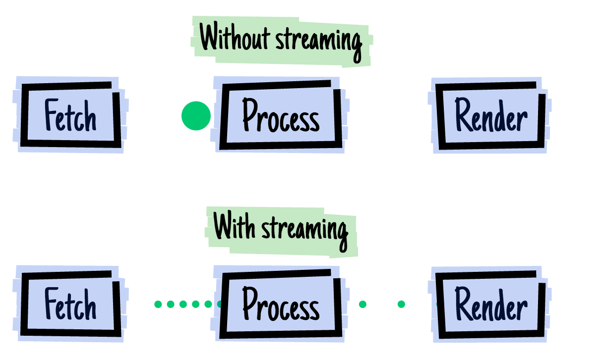

#【译】2016 - the year of web streams

> 这里[ 查看原文 ](https://jakearchibald.com/2016/streams-ftw/)

## stream 的优势

Promise 是一种可以很好解决单个值获取异步数据的方法，但是如果我们想获取多个值呢？或者说是要在数据传输过程中获取某一部分呢？

比如我们想获取并显示一张图片，那么需要包含这几个步骤：

1.从网络上获取数据

2.处理数据，将被压缩的数据还原成原始数据

3.渲染

我们有两种方式，直接一步全部获取，或者是用 stream：

如果我们一个字节一个字节的来处理响应，我们可以渲染图片的某一个部分，甚至说我们可以非常快的渲染出整个图片，因为用 fetch 处理流是可以并行的。这就是 streaming(流)，我们从网络中读一个数据流，解压并转换它，然后渲染到屏幕上。