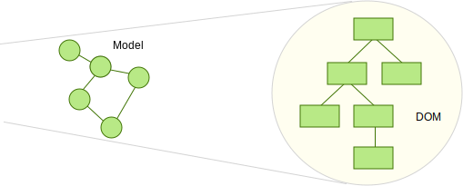
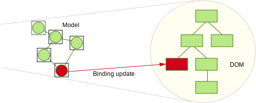

# 各种框架中的变化检测
## 导语
>[这里查看原文](http://teropa.info/blog/2015/03/02/change-and-its-detection-in-javascript-frameworks.html) 
>
> 最近一年里,前端框架层出不穷，Angular，Ember，React， Backbone 等等。
以至于我们眼花缭乱,选择焦虑。我们可以从各种方面来比较这些框架,而对于我来说,
最有趣的是比较他们的"状态管理"。这也是非常价值的。其实“状态管理”也算是老生常谈了，现在也有很多种方式，这篇文章我们就来探索目前主流框架包括：Ember 的数据绑定，Angular 的脏检测，React 的虚拟 DOM 和他们与不可变数据（immutable data）的关系。

##数据反射
我们主要谈论的内容(状态检测)就是讨论如何将程序内部的数据反应到屏幕上。程序中各种各样的数据(object,array,string,number)以各种方式(form,link,button,image)展示出来，在 web 中，我们将 JavaScript 对象展示在 DOM 中。

我们通常把这个过程叫做渲染(rendering)，你可以理解成将数据映射到用户界面上。当你将你的数据渲染到你的模板上的时候，你实际上会得到一组 DOM 或者 HTML 来呈现你的数据。

其实很简单：虽然有时候将数据模型映射到 UI 上会很复杂，但说到底，它还是一个简单的输入输出函数。

而当我们研究“状态监测”的时候就有些挑战了。“状态监测”发生在用户与 UI 交互，或者其他改变“数据模型”的时候，数据变化需要映射到 UI。然而，因为重新渲染 DOM 树是很昂贵的，我们需要用最少的次数去监测哪些 DOM 需要改变。

##服务端渲染：重置所有

####"没有什么变化，所有都不可变！"

在 web 1.0 时代，所有用户交互都会与服务端交互一次，每次点击或者提交表单都会使页面置为 unloaded 状态，客户端发请求到服务端，服务端返回一整个页面。

使用这种方法，实际上前端并不维护数据状态，每次发生交互都与前端无关，而都是后端负责，前端只负责展示生成HTML，CSS些许有一点 JavaScript 。

虽然从前端角度来说，这样非常简单，但是它效率也非常低，这样做不仅每次发生交互都要重新渲染整个页面，而且还是一种服务端的重新渲染，所以也伴随着一系列的数据调用。

大部分时候我们不会在我们的程序中用这种方法。通常我们会在首屏渲染是用服务端渲染，而后来的事情全部交给前端处理（参考 [isomorphic JavaScript](http://isomorphic.net/),[ more sophisticated versions of this pattern](https://signalvnoise.com/posts/3112-how-basecamp-next-got-to-be-so-damn-fast-without-using-much-client-side-ui)）

##第一代 JS 框架：手工重新渲染

####“我不知道什么需要重新渲染，你自己搞！”

在“第一代” JavaScript 框架中，例如  Backbone.js, Ext JS 或者 Dojo，首次推出了“数据模型”的概念，来替代一些基于 DOM 的轻量级的脚本。这也预示着我们第一次接触到了“状态管理”的概念，数据模型变化，同时反映到视图。

这些框架虽然帮助你将视图层与数据模型分离，但是它还是需要你来处理二者的同步工作，你来决定。

由于我们需要控制更新什么，什么时候更新，所以性能问题也通常也取决于我们自己。

##Ember.js:数据绑定

####“我知道更新什么以及需要重新渲染什么，因为我会控制你的数据模型和视图。”

当数据模型变化时必须手动处理重新渲染是第一代 JavaScript 框架的最主要复杂点。为了解决这个问题，又出现了很多框架，Ember.js 是其中之一。

Ember 像 Backbone 一样，当数据模型变化时触发事件，不同的是，在 Ember 中，there's also something the framework provides for the receiving end of the event，你可以将你的数据模型和 UI 绑定，这意味着会有一个监听者监听变化 ，当收到消息的时候，来更新 UI.

这是一种非常有效的更新机制，虽然数据绑定初始化时需要做一些工作，但是后续状态监测会非常简单。当某些数据变化时，只有需要改变的地方才改变。

用这种方法唯一不足之处是，Ember 必须时时刻刻知道数据什么时候变化，这就意味着你需要将数据放在一个继承自 Ember API 的特殊的对象中，然后当你改变数据的时候，你需要用它提供的 setter 方法，所以你不可以 `foo.x = 42`，你必须用` foo.set('x', 42)`。

现在随着 ES6 的到来，Ember 可以用更好的方法来处理数据绑定，所以数据变化时我们也不在需要 setter 方法了。

##AngularJS:脏检测

####“我不知道什么变化了，所以我会去检查所有的东西。”

像 Ember 一样，Angular 也是意在解决必须手工重新渲染的问题，但是它是从另外一个角度。

当你在你的 Angular 模板中创建数据的时候，比如`{{foo.x}}`，Angular 不仅渲染了数据，还对你的数据创建了观察者。任何时候你的数据有变化，Angular 都会检查每个观察者是否数据有变化。如果是，这些观察者执行更新 DOM ，这就叫做脏建检测。

这种检测策略的好处是你可以使用任何你想用的数据类型，Angular 没有限制-它也不关心，Angular 中不会有父类或者必须实现某些 API 。

这种方式的缺点也很明显，就是每个数据模型中都没有办法告诉框架是否变化，这意味着每个数据模型都需要检测变化，也正是 Angular 做的事情，所有观察者都需要执行检测，无论是点击事件，HTTP 响应，定时器等任何事情发生的时候。

一次执行所有的观察者听起来像是噩梦一样，但是惊奇的是其实这还挺快，这是因为知道我们检测出变化，我们操作的都不是 DOM ，原生的 JavaScript 对象检测起来还是比较廉价的。但是当你有一个庞大的 UI
组件，或者重新渲染非常频繁的时候，可能就需要做一些额外的性能优化了。

像 Ember 一样，Angular 同样会从即将到来的标准化受益：比如说， 在 ES7 中的Object.observe 会给 Angular 带来很多好处，因为它提供了一个原生的 API 用来处理监听对象的属性变化。但它也不会覆盖所有 Angular 需要的特性，Angular 的观察者除了观察对象属性变化意外还做了一些很多其他的事情。

在即将到来的 Angular2 中，带来了一些状态监测的优化，参考[ an article by Victor Savkin](http://victorsavkin.com/post/110170125256/change-detection-in-angular-2),[Victor's ng-conf talk](https://www.youtube.com/watch?v=jvKGQSFQf10&feature=youtu.be)

##React:虚拟DOM
####“我不知道什么变化了，所以我全部重新渲染一遍来看哪里发生了变化。”

React 有很多有趣的特性，今天我们来讨论其中最有趣的虚拟DOM。

React，像 Angular 一样，不会提供一套强制你数据模型使用的 API ,它是怎样保证 UI 与数据模型的同步呢？ 

React 的灵感来自于服务端渲染，像我们上面所说的，前端不需要关心任何东西：每次遇到交互都会重新渲染整个页面，这样可以大大的简化 UI 层的代码，在 React 组件中你不用关心任何的数据变化，就像服务端渲染一样，你只需要重新渲染就可以了。

听起来是不是会有疑问？这样做效率会不会太低了？其实 React 中的“重新渲染”用了一种特殊的方式。

当 React 渲染的时候，首先会生成一套虚拟 DOM ，而并不是真实的 DOM ，虚拟 DOM 可以理解为是一个轻量原生的 JavaScript 对象，它的数据结构可以映射成真实 DOM 树。之后 React 会根据虚拟 DOM 来生成真实的 DOM 节点。

当数据发生变化的时候，一套新的虚拟 DOM 又会重新生成，这套新的虚拟 DOM 对应变化之后的数据模型。这样目前就有两套虚拟 DOM：数据变化之前和变化之后的。随后 React 会用一套变化检测算法来比对这两套虚拟 DOM 来获取变化的节点，然后更新对应的真实 DOM 。

React 最大的有点就是它不需要你去跟踪数据变化。数据变化以后，你只需要重新渲染页面就可以了。通过 React 的检测算法配合虚拟 DOM 可以让你用最高效的方式来应对昂贵的 DOM 操作。

##Om:不可变数据（Immutable Data）
####“万物皆不变。”

虽然 React 虚拟 DOM 一般情况效率会很高，但如果你的页面很庞大或者渲染非常频繁（比如，大于60次每秒），那么也会遇到性能瓶颈。

其实对于每次都渲染整个页面来说，目前并没有一种比较好的方法解决，除非你手工来控制，比如 Ember 那样。

一种控制数据变化的方式是用[不可变数据](https://en.wikipedia.org/wiki/Persistent_data_structure)，这种方式很适合与 React 一起使用，参考 [Om](https://github.com/omcljs/om),[ClojureScript](https://github.com/clojure/clojurescript).

不可变数据，可想而知，你永远不能改变它，只能重新创建。如果你想改变一个属性，你必须带着要变化的属性在原对象的基础上创建一个新的对象，而原对象不会改变。这种方式非常有效，参考 [the way persistent data structures work](http://hypirion.com/musings/understanding-persistent-vector-pt-1).

这意味着，在 React 状态检测中，如果组件中只包含不可变数据的话，是存在一个“安全出口”的：当你重新渲染这个组件的时候，如果这个组件中的数据依然指向原引用，你可以跳过这次渲染，你只需要用上一次的虚拟 DOM.

像 Ember 一样，Om 这类的框架也需要用它提供的 API 来做数据操作，不同的是，这次这样做的目的不是为了让框架自身方便，而是为了让我们程序中的状态管理更简单，用不可变数据不仅可以提升渲染性能，还可以让我们的程序更有层次。

目前 Om 和 ClojureScript 可以和 React 方便的结合，但并不是唯一的，比如同样由 facebook 开发的更轻量的 [Immutable-js](http://facebook.github.io/immutable-js/)，更多信息可以参考 [React.js Conf 2015中的演讲](https://www.youtube.com/watch?v=I7IdS-PbEgI&feature=youtu.be)

##总结
变化检测是前端开发中的核心问题，JavaScript 框架也各自用不同的方式来解决。

EmberJS 可以检测变化因为它用一套数据模型 API 来监听你的数据变化。

Angular 通过数据绑定的方式，检测所有的数据是否变化并处理更新。

原始 React 通过在虚拟 DOM 中重新渲染并与历史虚拟 DOM 比较来确定应该更新的 DOM 并给真实 DOM 打补丁。

不可变数据与 React 结合后，通过让组件中的数据不可变，来让组件快速的标记为无变化，不重新渲染。这不仅仅可以优化性能，更重要的是优化你的代码架构。

