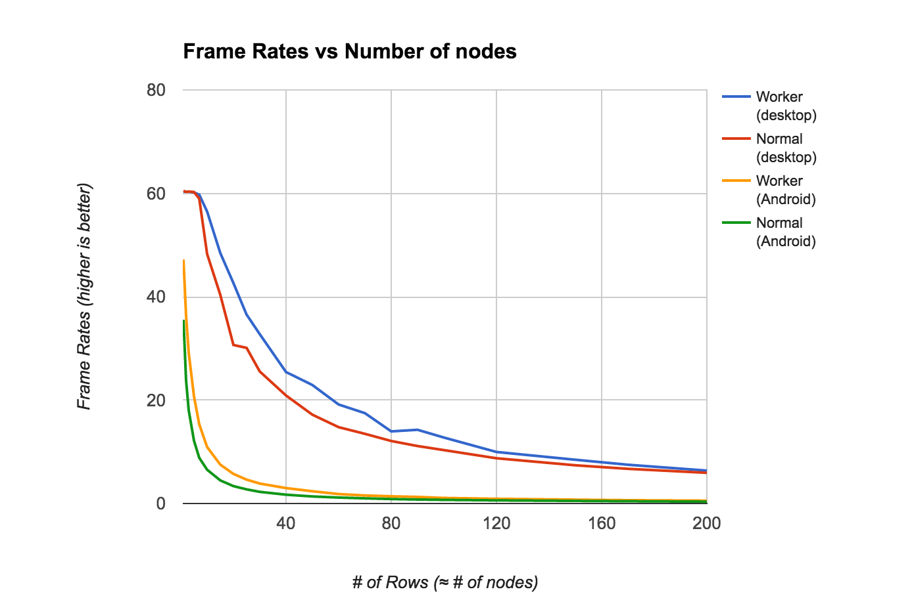
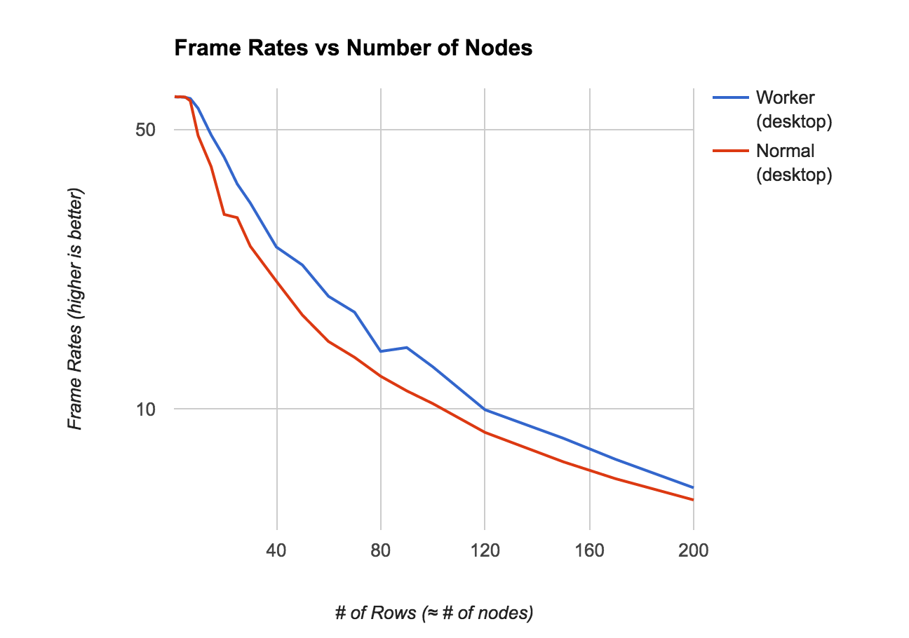

# 【译】用 Web Worker 为 React 提速
> [原文地址](http://blog.nparashuram.com/2016/02/using-webworkers-to-make-react-faster.html)  [demo](http://web-perf.github.io/react-worker-dom/)
 
标准的 React 应用由两部分构成—[React library ](https://www.npmjs.com/package/react)负责绝大部分的复杂的 Virtual DOM 计算，[React-Dom ](https://www.npmjs.com/package/react-dom)负责与浏览器真实 DOM 交互来展示内容。这两部分都是通过 script 标签引入到页面并运行在主线程上的。

在几周前我曾写了一片[文章](http://blog.nparashuram.com/2015/12/react-web-worker-renderer.html)，也写了一些试验性的代码，尝试在 Web Worker 中运行 React Virtual DOM 的相关计算，而不是传统的在主线程中进行。我也做了一些性能测试来分析可能影响渲染速度的参数，比如节点数量等。

##之前以为
之前的实验结论是，我们不能绝对的说 Web Worker 可以对渲染速率。只有当大量的节点发生变化的时候，Web Worker 提升渲染性能才会有一些效果。实际上，当节点数量非常少的时候(大多数应用中)，Web Worker 的性能可能还不如 React 本身实现。

##其实并不完全对
Web Worker 之所以慢的原因是因为大量的时间花费在了 Web Worker 与 主线程的消息通信上，所以我为了解决这个问题，试图找一个“通信最优方案”，网上有不少人给我提了宝贵经验：

1.[ 第一条建议 ](https://github.com/facebook/react/issues/3092#issuecomment-161471481)是传递消息的时候用[ transferable objects ](https://developer.mozilla.org/en-US/docs/Web/API/Web_Workers_API/Using_web_workers#Passing_data_by_transferring_ownership_%28transferable_objects%29)来代替 JSON。在 Worker 和主线程之间，我想要传递的被操作 DOM 的数据结构可能不是一个稳定的结构，因此，我需要制定一个公共的协议。

2.[ 第二条建议 ](https://twitter.com/nolanlawson/status/672486553567019009)是直接传递信息的时候用`JSON.stringify`，我猜这其实和 transferable objects 类似，这里还有一条来自 IndexedDB 作者的[ 评论 ](https://code.google.com/p/chromium/issues/detail?id=536620#c11)。

*用`stringifying`在主线程和 worker 中传递消息，React on Web Worker 可以比 传统的 React 更快了，而且好处会随着节点数量增加而增加。*

我写了一个基于 [browser-perf](http://npmjs.com/package/browser-perf) 自动化脚本用来计算帧速率，下图是生成的图表。测试分别运行在 Mac pro 上的 Chrome 和 Nexus 安卓设备。

当节点数量超过100个的时候，区别可能不是很明显了，为了让区别更明显，下表是在 pc chrome 上对比的帧速率。

如图所示，React Worker 版本都比标准 React 快，最坏情况是一样快，随着节点数量的增加区别也会越来越明显。

一个好的试验是可复现的，你可以用查看[ 这里 ](https://github.com/web-perf/react-worker-dom#testing-performance)来运行这个测试来收集结果，或者直接用 Chrome 的[ FPS meter ](https://www.youtube.com/watch?v=x6qe_kVaBpg&t=23m17s)来看[ worker ](http://web-perf.github.io/react-worker-dom/test/dbmonster/index.html#count=1&timeout=0&worker=true&rows=50)和[ normal ](http://web-perf.github.io/react-worker-dom/test/dbmonster/index.html#count=1&timeout=0&worker=false&rows=50)页面。 

##一个真实的 app
上面介绍了它在示例 DBMonster 上运行的结果，而更重要的是要把它运行到真实的场景当中。我写了一个[ todo app ](http://web-perf.github.io/react-worker-dom/test/todo/index.html?worker)来展示将 Web worker 与 React 结合，开发时都有哪些不同。其实[ 变化 ](https://github.com/web-perf/react-worker-dom#using-it-with-web-workers)也并不是很多，我们基本上只需要把 React 和 React-DOM 分别引入到 worker 和主页面中。

##浏览器事件
Web Worker 不能直接操作 DOM，也就是说不能监听 click 或者 scroll 事件。目前，React 有一套[ Event System ](https://facebook.github.io/react/docs/events.html)在最顶层监听所有的浏览器事件，将它们转化为虚拟的事件并传递给我们在 Virtual DOM 上定义的事件监听者。

对于我们的 Web worker，我重用了这个事件监听者并订阅了所有事件。因此，所有事件都在主线程中处理，转化为虚拟事件并传递给 worker，也就意味着所有关于创建虚拟事件的操作都在主线程中进行，一个可能改善的方案是，可以将原始事件传递给 worker，由 worker 来生成模拟事件并冒泡传递。

另外一个问题是关于`preventDefault()` 或者 `stopPropogation()`，这篇[ 文章 ](http://www.pocketjavascript.com/blog/2015/11/23/introducing-pokedex-org)也介绍这个问题。在浏览器中响应事件是同步操作，而与 Web worker 传递数据和获取结果的操作是异步的。因此，我们需要找到一种方式来确保在 worker 在处理事件中的时候我们是否需要阻止默认事件。

目前来说，我简单的阻止了所有的默认行为，但是这里为了确保正确性，有两个选择，像[ vjeux 的建议 ](http://blog.nparashuram.com/2015/12/react-web-worker-renderer.html#comment-2389241159)，我们需要用一个可以被序列化并传递到主线程的 function。[另一个选择](http://blog.nparashuram.com/2015/12/react-web-worker-renderer.html#comment-2390380630) 是阻止当前的事件并触发另外一个事件以防 `preventDefault`不被触发。

我还在其他的框架中寻找更好的解决方案，一定会有一个很好的模式来解决这个问题。

##下一步计划
通过测试我们可以得出结论是 Web Worker 是好的，也许我们将会经历所有主流 Javascript 框架都用 Web Worker 来处理复杂的计算的新时代。

我的实验可能会有一些瑕疵，我也会在真正的 app 中尝试，如果你有建议或者有兴趣尝试，我很愿意与你一起，你可以[联系我](https://twitter.com/nparashuram),或者在 [ github ](https://github.com/web-perf/react-perf)上发 pull request！