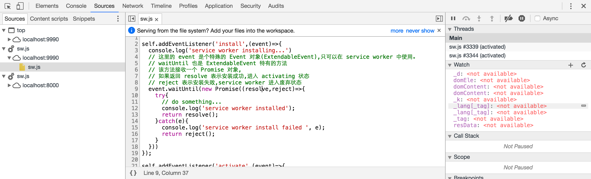
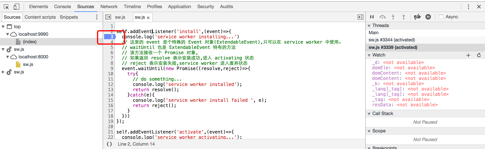
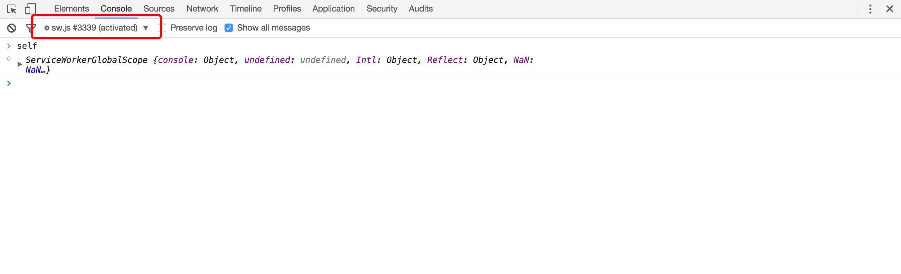
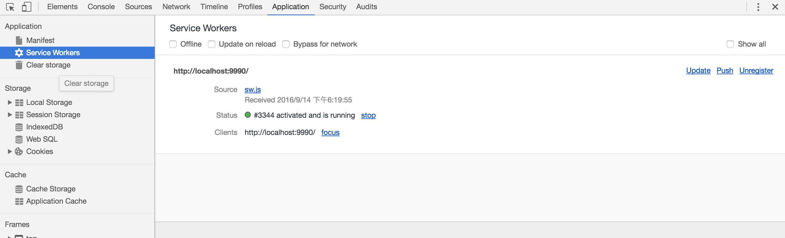
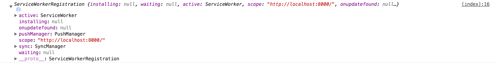

# SW：Try me？
> 上篇扯了 sw 是谁，但究竟怎么去写 sw，本篇文章将介绍。


## 代码片段
首先上代码：

index.html:

```
<!DOCTYPE html>
<html lang="en">
<head>
	<meta charset="UTF-8">
	<title></title>
</head>
<body>
<script>
	if ('serviceWorker' in navigator) {
		navigator.serviceWorker.register('./sw.js')
				.then(function(registration) {
					console.log(registration);
				})
				.catch(function(err) {
					console.log("Service Worker Failed to Register", err);
				})
	}
</script>
</body>
</html>
```

sw.js:

```
self.addEventListener('install',(event)=>{
  console.log('service worker installing...')
  event.waitUntil(new Promise((resolve,reject)=>{
    try{
      // do something...
      console.log('service worker installed');
      return resolve();
    }catch(e){
      console.log('service worker install failed ', e);
      return reject();
    }
  }))
});

self.addEventListener('activate',(event)=>{
  console.log('service worker activating...');
  event.waitUntil(new Promise((resolve,reject)=>{
    try{
      // do something...
      console.log('service worker activated');
      return resolve();
    }catch(e){
      console.log('service worker activate failed ', e);
      return reject();
    }
  }));
});
```

几行代码很简单就注册了一个 sw ，这时你可能会有点懵，我注册哪去了？
## sw 去哪了？
俗话说，每个前端都是暴露狂，作为前端，大家都已经习惯了将自己的代码赤裸裸的暴露给别人了，而我们的 sw 在浏览器哪里可以看到呢？首先，我们可以通过 chrome 开发者工具来找到 sw 的代码，下面是我再 chrome 52.0.2743 版本下的截图：

 

另外你可以访问`chrome://serviceworker-internals/`来查看所有的 sw 列表。
## 如何调试？
还是刚刚那幅图，我们可以在里面打断点调试。

 

我们还可以在 console 中选择 sw 执行环境输出打印.

 

另外，我们可以在 Application 中找到 sw 并做一些操作，根据字面很容易理解这些操作的用途，这里就不多说了。

 

## 代码解读
好了，前戏结束，下面我们来步入正题。上面代码虽然简单，但能做到了解每个细节也不容易。我来从下面几个方面来说说。
### ServiceWorkerRegistration 与生命周期
注册一个 sw 很简单，不过下面几行代码：

```
navigator.serviceWorker.register('./sw.js')
    .then(function(registration) {
        console.log(registration);
    })
```
这里的`registration `是一个`ServiceWorkerRegistration `类型的对象，从目前提供的 API 来看，`ServiceWorkerRegistration`的功能可以归结为两类，获得 sw 状态和推送相关（其实还有一个功能是[ 后台同步 ](https://developer.mozilla.org/en-US/docs/Web/API/SyncManager)，但目前标准还在确定中，现阶段无法使用）。本篇文章主要介绍获取 sw 状态的功能，后面会有专门的文章来介绍消息推送。理解 sw 状态之前，我们不得不先理解一下 sw 的生命周期，网上说 sw 生命周期的文章有很多，推荐[ 众城翻译 ](http://www.zcfy.cc/) 上的[ 这篇文章 ](http://www.zcfy.cc/article/the-service-worker-lifecycle-951.html)。下面这幅图很好的说明了 sw 的生命周期中的六个阶段：

 

然后我们再来看一下上面代码中打印出的 `registration `:

 

可能有些同学已经注意到了这几个属性：`active`,`installing`,`waiting`。它们记录了 sw 的当前状态。那么我们就从这几种状态入手：

* Parsed(解析成功)：解析成功，顾名思义，仅仅是解析成功，并没安装也没激活。当然解析成功也需要条件：

	* 最起码的，`register('./sw.js')`中文件能找到；
	* 脚本是同源的；
	* Https

	解析成功后，浏览器将自动尝试安装 sw ，也就进入了 installing 状态，此时`ServiceWorkerRegistration `中的`active`,`waiting`属性都为 null,`installing`中保存了 sw 实例。

* Installing(安装中)：此时浏览器执行 sw 的 install 事件，这里的事件为 ExtendableEvent 类型，下面会详细介绍。
* Installed(安装成功)：此时 sw 安装成功，但处于未激活状态，此时`ServiceWorkerRegistration `中的`active`,`installing `属性都为 null,`waiting`中保存了 sw 实例。
* activating(正在激活)：处于 activating 状态期间，Service Worker 脚本中的 activate 事件被执行，我们通常在 activate 事件中，清理 cache 中的文件。此时`ServiceWorkerRegistration `中的`waiting `,`installing `属性都为 null,`active`中保存了 sw 实例。
* activated(激活成功)：sw 处于激活状态，就可以处理定义的各种事件比如 fetch，message 等。此时`ServiceWorkerRegistration `中的`waiting `,`installing `属性都为 null,`active `中保存了 sw 实例，可以看到，activating 和 activated 状态时，`ServiceWorkerRegistration` 中都是`active`属性保存 sw 实例。
* redundant(废弃)：这个状态比较特殊，由于上面某种状态过程中失败，就会变成废弃状态。

以上介绍了可以获取 sw 状态的几个属性，下面再介绍两个相关方法：
`ServiceWorkerRegistration.update()`:每次 sw 脚本更新的时候，在页面刷新后都会重新安装，而这个方法提供了从页面上更新的方法。
`ServiceWorkerRegistration.unregister()`:可想而知，注销 sw。

### ExtendableEvent.waitUntil()

ExtendableEvent 继承自 Event，大家可能注意到上面 sw 安装和激活的时候都用了 waitUntil 方法，它的作用是什么呢？ waitUntil 接收一个 Promise，简单来说，作用就是在 Promise resolve 之前，下面步骤都被阻塞，如果 Promise 返回 reject(),则该步骤失败，sw 进入 redundant 状态。

## 总结
了解了如何注册 sw ，并了解了注册过程中比较重要的两个对象，后面将会以一个具体的例子展现 sw 的离线功能，敬请期待吧！


>_本文为原创文章，欢迎转载，有任何问题，欢迎留言讨论。_