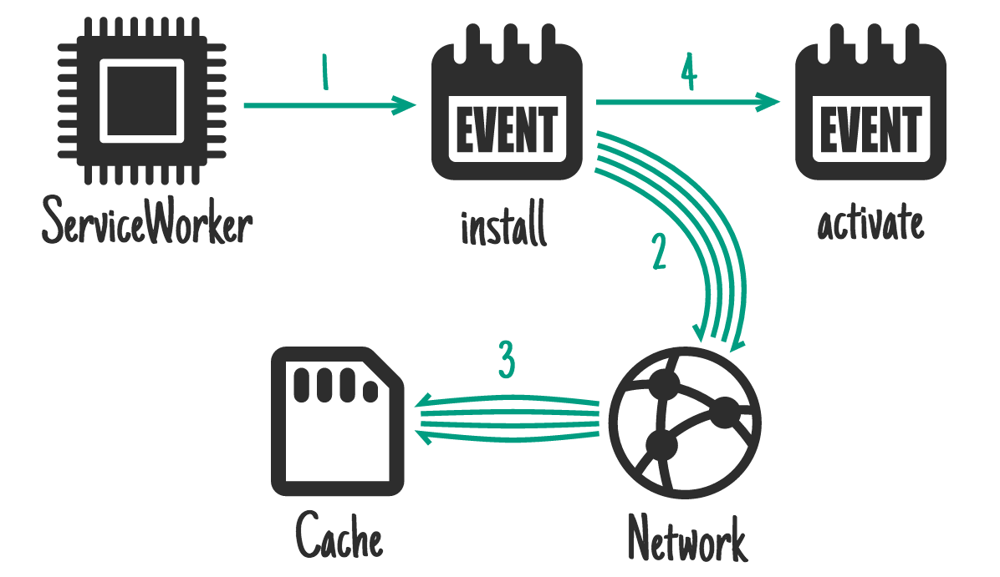

# 【译】离线 Web 应用
> 这里[ 查看原文 ](https://jakearchibald.com/2014/offline-cookbook/)

之前我分享了一份关于[ 离线应用 ](https://www.udacity.com/course/offline-web-applications--ud899)的课程，其中分别讲述了在线应用和离线应用，很多模式在这篇文章中将会被用到。

ServiceWorker 为我们提供了处理离线功能的方法，允许我们处理缓存和各种请求。这说明我们可以自己制定离线模式，下面我们就来看一下可能用到的几种离线模式，在实际中，我们大部分会把他们结合在一起使用。

无特殊说明，下面所有的代码可以运行在新版的 Chrome 和 Firefox 中，查看完整的 SrviceWorker 支持情况，参考[ 这里 ](https://jakearchibald.github.io/isserviceworkerready/).

这些模式在实际中的用途，参考[  Trained-to-thrill ](https://jakearchibald.github.io/trained-to-thrill/) 和 [ this video ](https://www.youtube.com/watch?v=px-J9Ghvcx4).

## 何时缓存资源?

ServiceWorker 处理请求和缓存相互独立，所以我们分别讨论它们，首先我们来说，可以在什么时机去缓存资源？

### On install - as a dependency

ServiceWorker 提供了`install`事件，我们可以在这个时候处理我们需要的资源，只有当资源全部处理好，后续的事件才会被触发(activate)